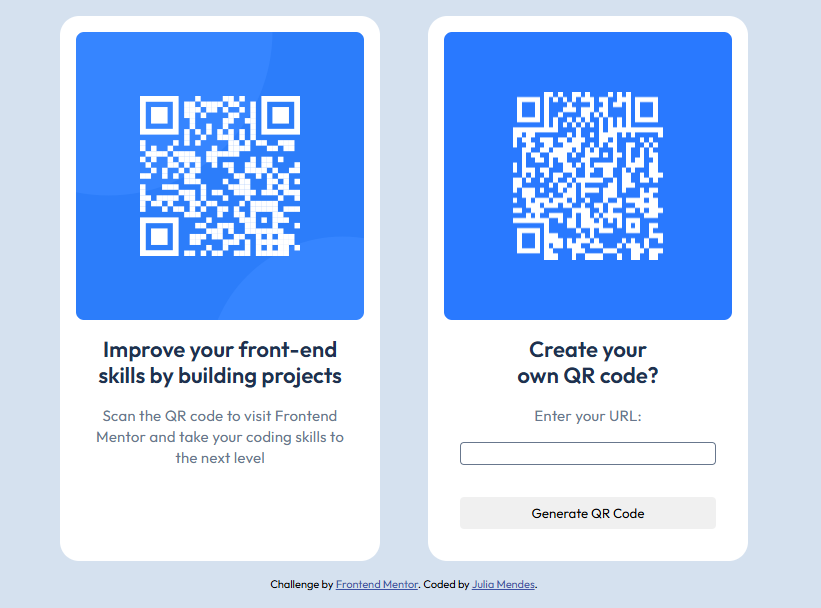

# Frontend Mentor - QR code component solution

This is a solution to the [QR code component challenge on Frontend Mentor](https://www.frontendmentor.io/challenges/qr-code-component-iux_sIO_H). Frontend Mentor challenges help you improve your coding skills by building realistic projects. Besides providing the solution, I decided to extend the practice and create a simples QR Code generator

## Table of contents

- [Overview](#overview)
  - [Screenshot](#screenshot)
  - [Links](#links)
- [My process](#my-process)
  - [Built with](#built-with)
  - [What I learned](#what-i-learned)
  - [Continued development](#continued-development)
  - [Useful resources](#useful-resources)
- [Author](#author)
- [Acknowledgments](#acknowledgments)

**Note: Delete this note and update the table of contents based on what sections you keep.**

## Overview

### Screenshot

### Links

- [Solution URL](https://github.com/juliamendesc/qrcode-component)
- [Live Site URL ](https://juliamendesc.github.io/qrcode-component/)

## My process

### Built with

- Semantic HTML5 markup
- CSS custom properties
- Flexbox
- Mobile-first workflow
- [React](https://reactjs.org/) - JS library
- [Next.js](https://nextjs.org/) - React framework
- [QRCode.js](http://davidshimjs.github.io/qrcodejs/) - For converting text to QR Code

### What I learned

With this project, I intended to review and perfect some simple components creating processes, as well as pay more attention to design details.

### Continued development

After finishing, I decided to make it functional, adding a feature to create your own QRCode from an URL.

## Author

- LinkedIn - [Julia Mendes](https://www.linkedin.com/in/juliamendesc/)
- Frontend Mentor - [@juliamendesc](https://www.frontendmentor.io/profile/juliamendesc)
- Github - [@juliamendesc](https://github.com/juliamendesc)
